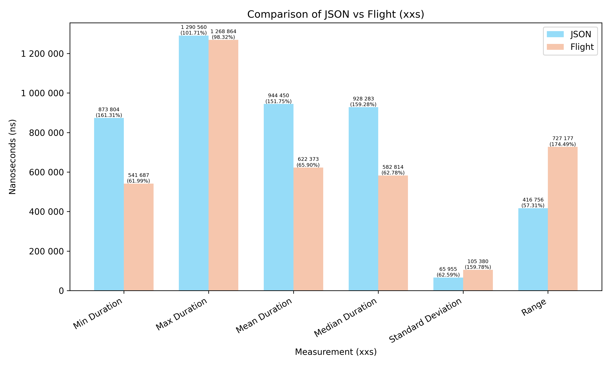

# Benchmark Polars Arrow vs Json

The folder contains two measurements. One implementation in Rust, another implemented in Python.

The goal is to compare the performance of Polars Arrow and Json data transfer performance.

The data flow is the following:
- Data (Polars Dataframe) is created upfront in memory.
- The data then serialized (Json or Arrow)
- Sent to the client (via Rest or Arrow Flight)
- Client reads the data.
- The data is deserialized (Json or Arrow) into the Polars Dataframe.

There are multiple datasets, where each record contains an integer, a string (integer as English word), and a timestamp. Sizes are:
- `xxs`: 1 record
- `xs`: 10 records
- `s`: 100 records
- `m`: 1000 records
- `l`: 10000 records
- `xl`: 100000 records
- `xxl`: 1000000 records

### Memory and CPU usage

It was not directly measured, but the following maximum numbers were observed in Windows Task Manager:

Python JSON Server: ~400MB memory & 4.0% CPU

Python Flight Server: ~350MB memory & 0.9% CPU

Python JSON Server: ~340MB memory & 5.8% CPU

Python Flight Server: ~320MB memory & 6% CPU

## Execution

Python [implementation is explained](python/readme.md) in the `python` folder.

Rust implementation:
- Compile wilt `cargo build --release`.
- Run JSON server with `cargo run --release --bin server-axum`.
- Run JSON server with `cargo run --release --bin server-flight`.
- Run the benchmark with `cargo run --release --bin perftest`.

## Results

Result are collected in the `stats` folder. Csv files are containing the detailed measurements.

Once all tests are executed, run the [python script (Plot section)](python/readme.md#plot) described in the python folder to generate the updated diagrams.

## Compare Mean Duration

The following diagram shows the mean duration of the tests in nanoseconds on different data size. The % values are showing the difference between the two results.

For example 50% on Flight means that the Flight duration is 50% of the JSON duration. Similarly, 200% on JSON means that the JSON duration is 200% of the Flight duration.

### Python

### Rust

## Detailed Results - Python

### xxs

### xs

### s

### m

### l

### xl

### xxl

## Detailed Results - Rust

### xxs

### xs

### s

### m

### l

### xl

### xxl

